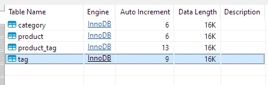
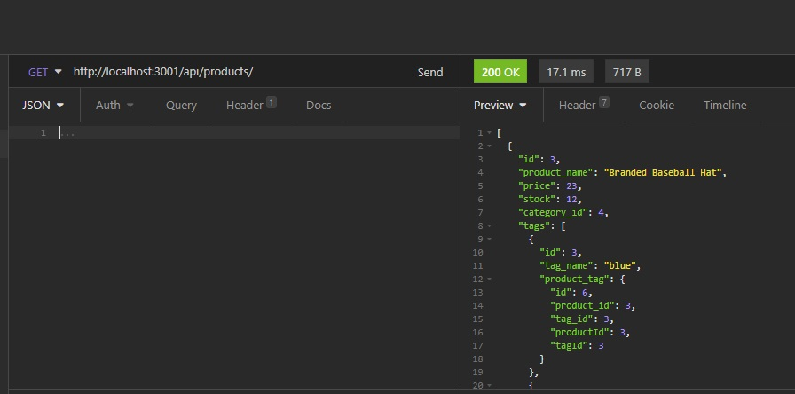

# E-commerce backend
## Description
this app was created in nodeJS to simulate or be used as an e-commerce backend.
## Table of Contents 
* [Installation](#installation)
* [Usage](#usage)
* [Tests](#tests)
* [Questions](#questions)
## Installation
To install necessary dependencies, run the following command:
```
npm i
```
## Usage
watch the video for a walkthrough on how to use this .
https://youtu.be/oPAdEofYpjQ
## 
## 
## Tests
To run tests, run the following command:
```
npm test
```
## Questions
If you have any questions about the repo, open an issue or contact me directly at nicollas@gmail.com. 
You can find more of my work at [nickverneck](https://github.com/nickverneck/).

